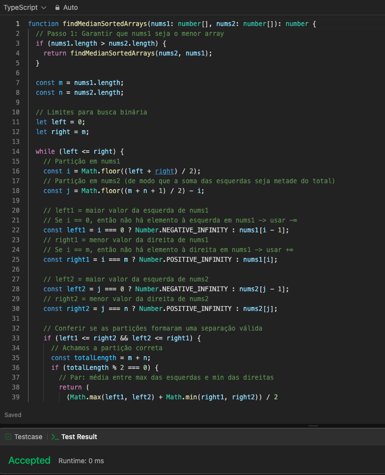
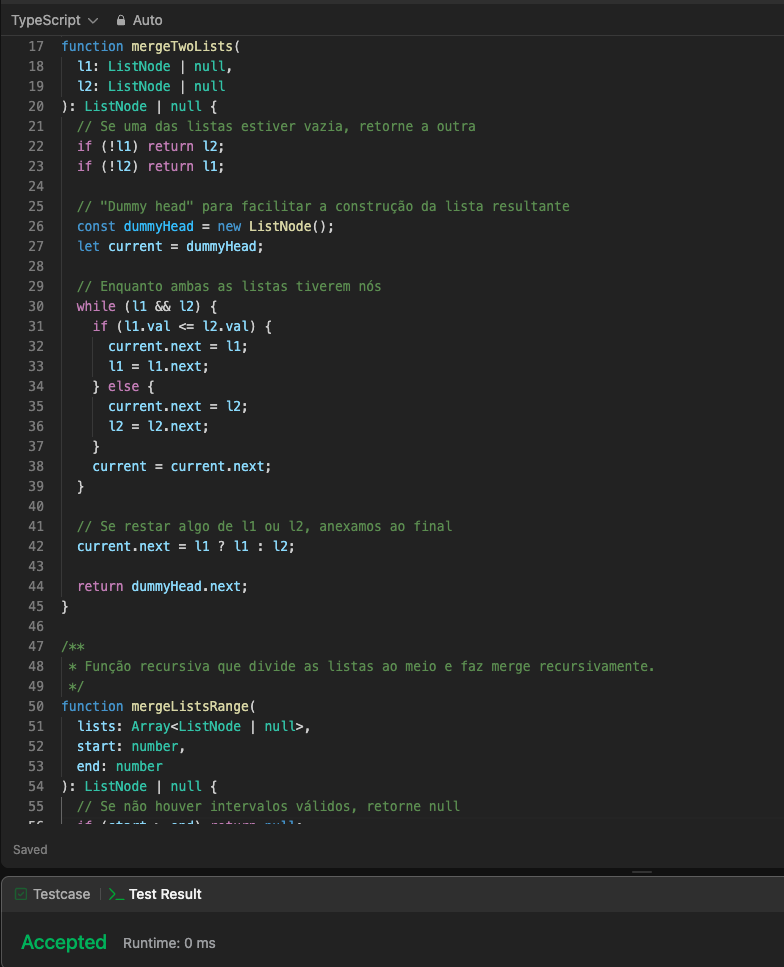
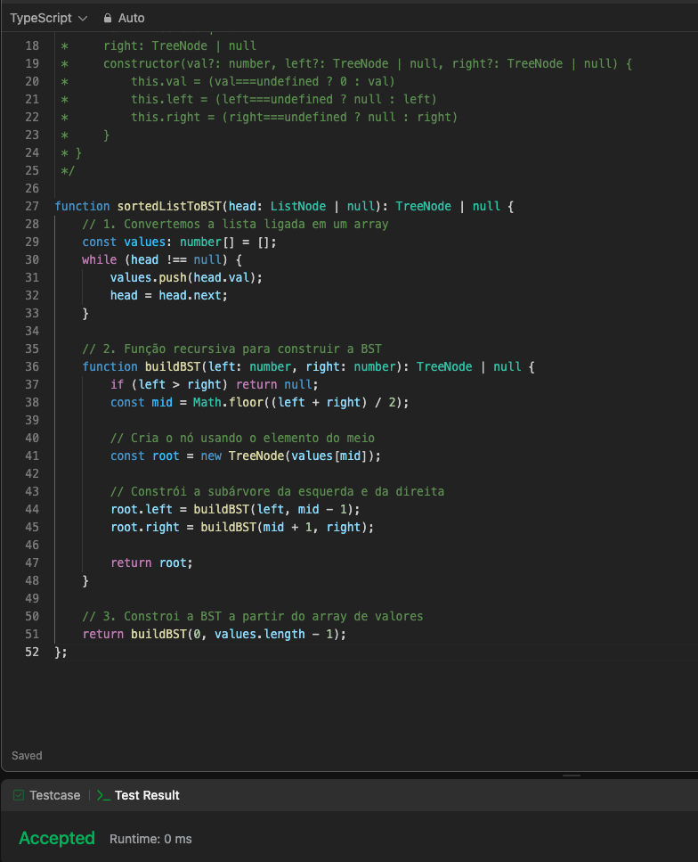

# LeetCode questions

**Número da Lista**: 3<br>
**Conteúdo da Disciplina**: Dividir e Conquistar<br>

## Alunos
| Matrícula | Aluno                     |
| --------- | ------------------------- |
| 200054333 | Arthur Gabriel Lima Gomes |
| 211061350 | Alexandre de Santana Beck |

## Sobre 
O projeto consiste em resolver questões do site LeetCode, que é uma plataforma de aprendizado de algoritmos e estruturas de dados. O site contém uma grande quantidade de questões de programação, que variam de fácil a difícil. O objetivo é resolver as questões propostas e explicar a solução de cada uma delas.

## Screenshots

### Questão 4 - Median of Two Sorted Arrays (Difícil)



### Questão 23 - Merge k Sorted Lists (Difícil)



### Questão 109 - Convert Sorted List to Binary Search Tree (Médio)



## Instalação 
**Linguagem**: Typescript<br>

Para rodar o projeto é necessário clonar o projeto.

``` bash
git clone https://github.com/projeto-de-algoritmos-2024/DividirConquistar-LeetCode.git
```

Após clonar o projeto, para rodar basta executar o comando abaixo:

``` bash
npm run start
```

## Uso 
Para aplicar os casos de teste (in e out), basta acessar o link referente ao exercício no LeetCode e inserí-los no prompt de comando, também é possível gerar novos casos de teste, desde que cumpram os requisitos do exercício em questão.
